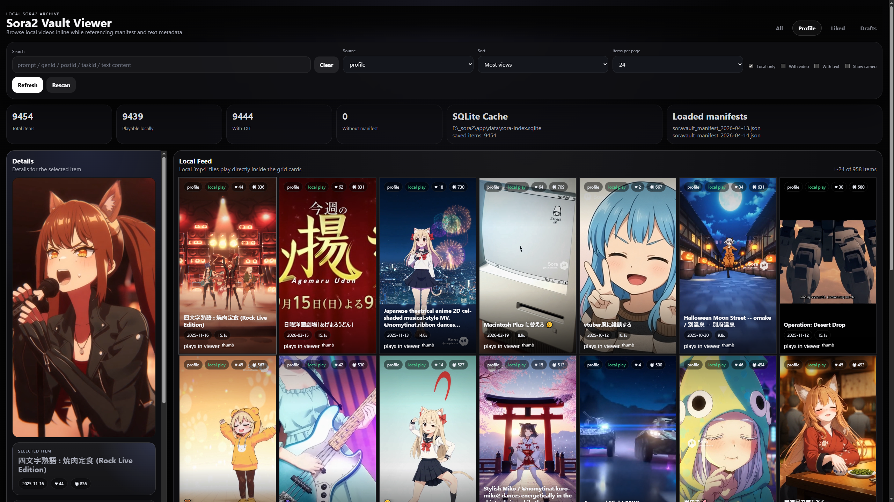

# Sora2 Vault Viewer

A lightweight local viewer for browsing Sora manifest exports together with local `mp4` and `txt` files.

This project assumes the data structure produced by [SoraVault 2.0](https://github.com/charyou/SoraVault), including `soravault_manifest_*.json` files and the `sora_v2_profile`, `sora_v2_liked`, and `sora_v2_drafts` directory layout. This repository does not include or reuse SoraVault source code. It only works with the data structure generated by SoraVault 2.0 exports.



## Overview

- Merges all `soravault_manifest_*.json` files found in `sora2_data/`
- Matches manifest items with local files from `sora_v2_profile`, `sora_v2_liked`, and `sora_v2_drafts`
- Plays local videos inline in a dark gallery UI with a right-side details panel
- Searches by prompt, `genId`, `postId`, `taskId`, and TXT content with auto-apply filtering
- Supports pagination, page size selection, source filtering, and sorting by date, prompt, duration, views, likes, and source order
- Supports keyboard browsing across gallery cards with `Tab`, `Enter`, `Space`, and arrow keys
- Shows manifest-derived metadata such as `posted by`, likes, views, loaded manifest names, and TXT content

## Quick Start

Requirements:
- Node.js 22.13+
- Verified in practice with Node.js 24

Windows (PowerShell):

```powershell
git clone https://github.com/tinatsu-nomy/sora2-vault-viewer.git
cd sora2-vault-viewer
mkdir sora2_data
```

Project structure:

```text
app/
  public/
    index.html
    app.js
    styles.css
  server.js
sora2_data/
  soravault_manifest_*.json
  sora_v2_profile/
  sora_v2_liked/
  sora_v2_drafts/
```

Download your Sora2 export data into `sora2_data/` so the layout looks like this:

```text
sora2_data/
  soravault_manifest_*.json
  sora_v2_profile/
  sora_v2_liked/
  sora_v2_drafts/
```

Then start the viewer:

```powershell
npm start
```

The app starts at `http://localhost:3210` by default and automatically moves to the next free port if needed. To stop the server, return to the terminal where it is running and press `Ctrl+C`.

Optional environment variables:
- `PORT`: starting port for the local server
- `SORA_BIND_HOST`: bind host for the HTTP server. Defaults to `127.0.0.1`
- `SORA_DATA_DIR`: override the data directory location
- `SORA_VIEWER_ROOT`: override the repository root when `sora2_data/` lives directly under a different parent directory

Common examples:

```powershell
# default
npm start
```

```powershell
# custom data directory
$env:SORA_DATA_DIR = "D:\SoraExports\sora2_data"
npm start
```

```powershell
# custom port
$env:PORT = "3211"
$env:SORA_DATA_DIR = "D:\SoraExports\sora2_data"
npm start
```

## Data Layout

Add new manifest JSON files:

1. Copy the new `soravault_manifest_*.json` file into `sora2_data/`
2. Keep the `soravault_manifest_*.json` naming pattern so the viewer can detect it automatically
3. Click `Rescan` or restart the server
4. Confirm the file name appears in `Loaded manifests`

Add new local media and TXT files:

1. Put exported files into the matching source directory:
   - `sora_v2_profile`
   - `sora_v2_liked`
   - `sora_v2_drafts`
2. Keep each `mp4` and `txt` pair together using the exported file names from SoraVault 2.0
3. Click `Rescan` or restart the server
4. Confirm the new items appear in the gallery and detail view

How local files are linked to manifest JSON:

- The files must be placed in the matching source directory (`profile`, `liked`, or `drafts`)
- The `mp4` and `txt` files must share the same stem
- The viewer must be able to match the local files to a manifest item using one or more identifiers such as `generationId`, `taskId`, `postId`, extracted ID tokens, or the file stem

In practice, a SoraVault 2.0 filename template such as `{date}_{genId}` has been confirmed to work with this viewer.

If these conditions are not met, the files can still appear as `local-only` items, but they will not be linked to manifest JSON metadata.

## Behavior / Limits

- `Local only` is enabled by default so the initial feed focuses on files that exist locally
- The server binds to loopback (`127.0.0.1`) by default, so it is local-only unless you explicitly override `SORA_BIND_HOST`
- `Rescan` re-detects `soravault_manifest_*.json` files each time, so newly added manifests can be picked up without restarting the server
- Malformed or partially written manifest JSON files are skipped and recorded instead of terminating the viewer
- Index, detail, rebuild, and media failures are surfaced as recoverable UI or API errors instead of silently breaking the app
- The `/media` endpoint serves only indexed local `mp4` and `txt` files
- Sora 1 data is not supported because no Sora 1 export data was available for development or validation

## Troubleshooting

- If new manifests or files do not appear, click `Rescan` and then check `Loaded manifests`
- If a manifest is malformed, the viewer skips it and continues indexing the remaining files
- If the UI shows an index, detail, or rebuild error, fix the underlying file issue and try `Rescan` again
- Run `npm run check` for syntax validation and `npm test` for the smoke test fixture
- Local media, manifests, caches, and backup logs are intentionally excluded by `.gitignore`
- This repository is provided as-is, without warranty or guarantee of compatibility, correctness, completeness, or fitness for a particular purpose
- Behavior is intended for SoraVault 2.0 export layouts and is not guaranteed for other export formats or future versions

## License

MIT
